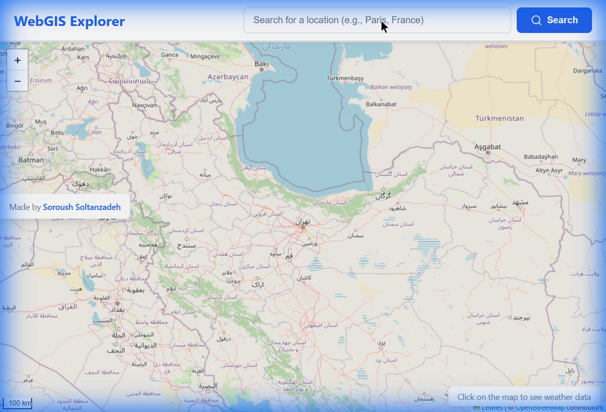
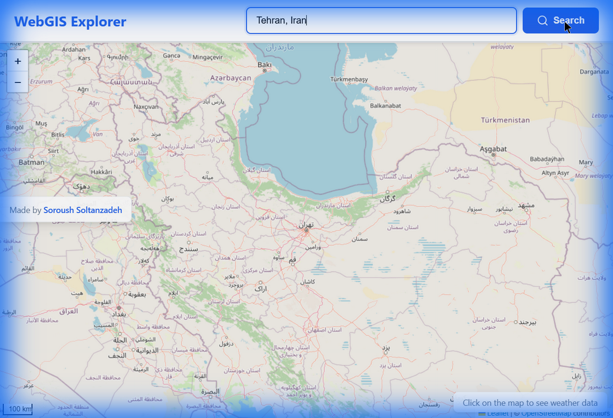
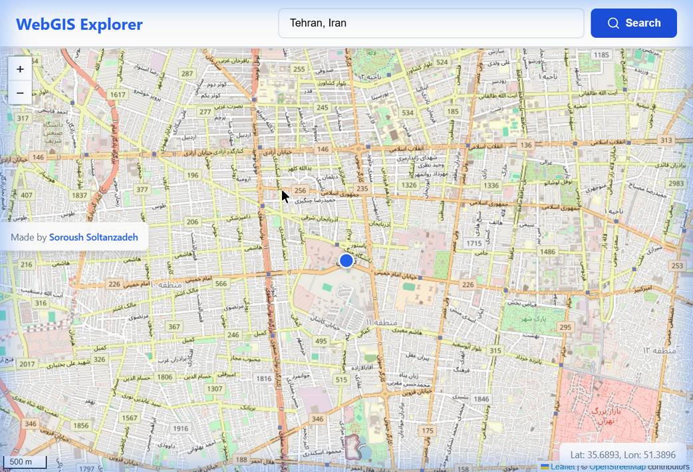
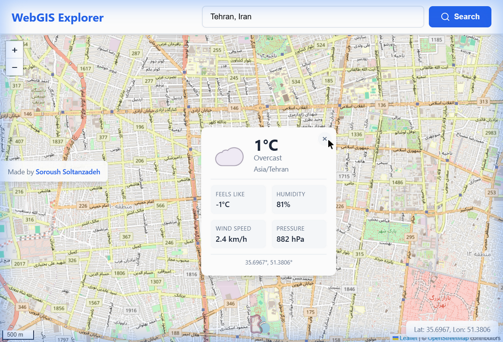
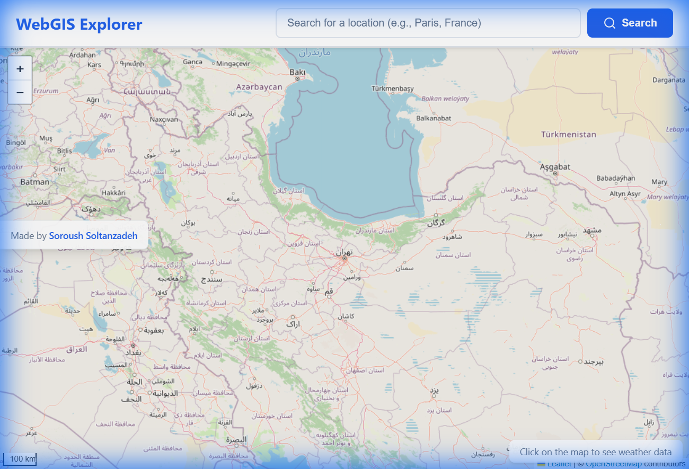

# WebGIS Interactive Map Application

A web-based Geographic Information System (GIS) application built with OpenLayers, featuring geocoding search functionality and real-time weather data display.



---

## Table of Contents

1. [Project Overview](#project-overview)
2. [Features](#features)
3. [Setup Instructions](#setup-instructions)
4. [OpenLayers Features Documentation](#openlayers-features-documentation)
5. [Geocoding API Comparison](#geocoding-api-comparison)
6. [Weather API Comparison](#weather-api-comparison)
7. [Project Structure](#project-structure)
8. [Usage Guide](#usage-guide)
9. [Screenshots](#screenshots)

---

## Project Overview

This application demonstrates the integration of OpenLayers mapping library with external APIs to create an interactive web mapping experience. Users can:

- Search for locations using a geocoding service
- Click on any point on the map to view current weather conditions
- Navigate the map with smooth animations and intuitive controls

**This application uses completely FREE APIs that require NO API keys!**

---

## Features

### Part 1: Interactive Map with Geocoding Search

- OpenLayers map with OpenStreetMap base layer
- Search bar with geocoding functionality (Nominatim - FREE)
- Smooth animated transitions to searched locations
- Marker placement at searched locations
- Error handling for invalid searches

### Part 2: Weather Data Display

- Click event detection on map
- Real-time weather data fetching (Open-Meteo - FREE)
- Weather overlay display with temperature, conditions, and humidity
- Loading states and error handling
- Responsive weather card design

---

## Setup Instructions

### Prerequisites

- A modern web browser (Chrome, Firefox, Safari, Edge)
- A text editor (VS Code, Sublime Text, etc.)

### Installation

1. **Clone the repository**
   ```bash
   git clone https://github.com/YOUR_USERNAME/webgis-assignment.git
   cd webgis-assignment
   ```

2. **Open the application**
   - Simply open `index.html` in your web browser
   - Or use a local server (recommended):
     ```bash
     # Using Python
     python -m http.server 8000
     
     # Using Node.js
     npx serve
     ```

3. **Access the application**
   - Navigate to `http://localhost:8000` in your browser

**No API keys required!** Both APIs used in this project are completely free and open.

---

## APIs Used

### Geocoding: Nominatim (OpenStreetMap)

- **Website**: https://nominatim.org/
- **Cost**: FREE (no API key required)
- **Rate Limit**: 1 request per second
- **Coverage**: Worldwide

### Weather: Open-Meteo

- **Website**: https://open-meteo.com/
- **Cost**: FREE (no API key required)
- **Rate Limit**: 10,000 requests per day
- **Coverage**: Worldwide

---

## OpenLayers Features Documentation

This section documents all OpenLayers features used in this project.

### 1. Map Initialization

```javascript
const map = new ol.Map({
  target: 'map',
  layers: [...],
  view: new ol.View({...}),
  controls: ol.control.defaults().extend([...])
});
```

**Purpose**: Creates the main map instance that serves as the container for all map-related functionality.

| Property | Description |
|----------|-------------|
| `target` | The DOM element ID where the map will be rendered |
| `layers` | Array of layer objects to display on the map |
| `view` | Defines the initial view settings (center, zoom) |
| `controls` | UI controls for map interaction |

### 2. Layers

#### Tile Layer (Base Map)

```javascript
new ol.layer.Tile({
  source: new ol.source.OSM()
})
```

**OpenStreetMap (OSM) Source**: 
- Provides free, open-source map tiles
- Automatically handles tile loading and caching
- Supports multiple zoom levels (0-19)

#### Vector Layer (Markers)

```javascript
new ol.layer.Vector({
  source: new ol.source.Vector(),
  style: new ol.style.Style({...})
})
```

**Purpose**: Displays point features (markers) on the map for searched locations.

| Component | Description |
|-----------|-------------|
| `ol.source.Vector` | Stores vector features (points, lines, polygons) |
| `ol.style.Style` | Defines visual appearance of features |
| `ol.style.Circle` | Creates circular marker symbols |
| `ol.style.Fill` | Sets the fill color of features |
| `ol.style.Stroke` | Sets the outline/border of features |

### 3. View Configuration

```javascript
new ol.View({
  center: ol.proj.fromLonLat([0, 0]),
  zoom: 2,
  minZoom: 2,
  maxZoom: 19
})
```

| Property | Description |
|----------|-------------|
| `center` | Initial center point of the map (in map projection) |
| `zoom` | Initial zoom level |
| `minZoom` | Minimum allowed zoom level |
| `maxZoom` | Maximum allowed zoom level |

### 4. Coordinate Projection

```javascript
ol.proj.fromLonLat([longitude, latitude])
ol.proj.toLonLat(coordinate)
```

**Purpose**: Converts between geographic coordinates (EPSG:4326) and Web Mercator projection (EPSG:3857) used by OpenLayers.

| Function | Input | Output |
|----------|-------|--------|
| `fromLonLat()` | [lon, lat] in degrees | [x, y] in meters (Web Mercator) |
| `toLonLat()` | [x, y] in meters | [lon, lat] in degrees |

### 5. Controls

#### Default Controls
```javascript
ol.control.defaults()
```

Includes:
- **Zoom**: +/- buttons for zoom control
- **Rotate**: Reset rotation button (appears when rotated)
- **Attribution**: Map data attribution display

#### Scale Line Control
```javascript
new ol.control.ScaleLine({
  units: 'metric'
})
```

**Purpose**: Displays a scale bar showing map distance units.

#### Full Screen Control
```javascript
new ol.control.FullScreen()
```

**Purpose**: Allows users to view the map in full-screen mode.

### 6. Animations

```javascript
view.animate({
  center: ol.proj.fromLonLat([lon, lat]),
  zoom: 14,
  duration: 1500
});
```

**Purpose**: Provides smooth transitions when navigating to new locations.

| Property | Description |
|----------|-------------|
| `center` | Target center coordinates |
| `zoom` | Target zoom level |
| `duration` | Animation duration in milliseconds |

### 7. Overlays

```javascript
new ol.Overlay({
  element: document.getElementById('weather-popup'),
  positioning: 'bottom-center',
  offset: [0, -10],
  autoPan: true
});
```

**Purpose**: Displays HTML elements (like weather popups) at specific map coordinates.

| Property | Description |
|----------|-------------|
| `element` | DOM element to display as overlay |
| `positioning` | Position of element relative to coordinate |
| `offset` | Pixel offset from position |
| `autoPan` | Automatically pan map to show overlay |

### 8. Features and Geometry

```javascript
new ol.Feature({
  geometry: new ol.geom.Point(
    ol.proj.fromLonLat([lon, lat])
  )
})
```

**Purpose**: Represents geographic features with geometry and optional attributes.

### 9. Event Handling

```javascript
map.on('click', function(evt) {
  const coordinate = evt.coordinate;
  // Handle click event
});
```

**Purpose**: Responds to user interactions with the map.

| Event | Description |
|-------|-------------|
| `click` | Single click on map |
| `pointermove` | Mouse/pointer movement |
| `moveend` | Map view change completed |

---

## Geocoding API Comparison

### APIs Researched

| Feature | Nominatim (OSM) | MapQuest Geocoding | Google Geocoding | Bing Maps |
|---------|-----------------|-------------------|------------------|-----------|
| **Free Tier** | Unlimited | 15,000 requests/month | $200 credit/month | 125,000 transactions/year |
| **API Key Required** | No | Yes | Yes | Yes |
| **Rate Limit** | 1 request/second | 30 requests/second | 50 requests/second | 50 requests/second |
| **Paid Pricing** | Free (donations) | $4.99/1,000 | $5.00/1,000 | $4.00/1,000 |
| **Accuracy** | Medium-High | High | Very High | High |
| **Global Coverage** | Excellent | Excellent | Excellent | Excellent |
| **Documentation** | Good | Good | Excellent | Good |

### Price Ratio Analysis

Taking **MapQuest** as the baseline (1.0x):

| API | Price per 1,000 Requests | Price Ratio |
|-----|-------------------------|-------------|
| **Nominatim** | $0 (free) | 0x (FREE!) |
| **MapQuest** | $4.99 | 1.0x (baseline) |
| **Bing Maps** | $4.00 | 0.80x |
| **Google Geocoding** | $5.00 | 1.00x |

### Cost Comparison for 100,000 Requests/Month

| API | Monthly Cost | Annual Cost |
|-----|--------------|-------------|
| **Nominatim** | $0 | $0 |
| **MapQuest** | $424.15 | $5,089.80 |
| **Bing Maps** | $339.32 | $4,071.84 |
| **Google Geocoding** | $300.00 | $3,600.00 |

### My Choice: Nominatim (OpenStreetMap)

**Justification:**

1. **Completely Free**: No API key required, no registration needed, no cost at any scale.

2. **Open Source**: Built on OpenStreetMap data, which is community-maintained and constantly updated.

3. **No Registration Required**: Can start using immediately without creating accounts or managing API keys.

4. **Privacy-Friendly**: No tracking or data collection by third-party commercial entities.

5. **Global Coverage**: Excellent worldwide coverage with detailed data for most regions.

6. **Educational Appropriate**: Perfect for academic projects where cost and setup complexity should be minimized.

**Trade-offs Accepted:**

- **Rate Limiting (1 req/sec)**: Acceptable for this educational project; prevents abuse of the free service.
- **Usage Policy**: Must include User-Agent header and respect usage guidelines.

### API Websites

| API | Official Website |
|-----|-----------------|
| Nominatim | https://nominatim.org/ |
| MapQuest Geocoding | https://developer.mapquest.com/documentation/geocoding-api/ |
| Google Geocoding | https://developers.google.com/maps/documentation/geocoding |
| Bing Maps | https://docs.microsoft.com/en-us/bingmaps/rest-services/locations/ |

---

## Weather API Comparison

### APIs Researched

| Feature | Open-Meteo | OpenWeatherMap | WeatherAPI | Tomorrow.io |
|---------|-----------|---------------|------------|-------------|
| **Free Tier** | 10,000 calls/day | 1,000 calls/day | 1,000,000 calls/month | 500 calls/day |
| **API Key Required** | No | Yes | Yes | Yes |
| **Rate Limit** | 10,000/day | 60 calls/min | 1,000 calls/day | 25 calls/hour |
| **Paid Pricing** | Free (donations) | $0.0015/call | $4/month | $25/month |
| **Data Quality** | Excellent | Good | Excellent | Excellent |
| **Forecast Days** | 16 days (free) | 5 days (free) | 3 days (free) | 6 hours (free) |
| **Historical Data** | 80+ years (free) | Paid only | Limited free | Paid only |

### Price Ratio Analysis

Taking **OpenWeatherMap** as the baseline (1.0x):

| API | Price per 1,000 Calls | Price Ratio |
|-----|----------------------|-------------|
| **Open-Meteo** | $0 (free) | 0x (FREE!) |
| **WeatherAPI** | $0.002 | 0.001x |
| **OpenWeatherMap** | $1.50 | 1.0x (baseline) |
| **Tomorrow.io** | $1.67 | 1.11x |

### Cost Comparison for 50,000 Calls/Month

| API | Monthly Cost | Annual Cost |
|-----|--------------|-------------|
| **Open-Meteo** | $0 | $0 |
| **WeatherAPI** | $4.00 (flat rate) | $48.00 |
| **OpenWeatherMap** | $30.00 | $360.00 |
| **Tomorrow.io** | $25.00 | $300.00 |

### My Choice: Open-Meteo

**Justification:**

1. **Completely Free**: No API key required, no registration, no cost at any usage level.

2. **Generous Free Tier**: 10,000 calls/day is extremely generous compared to competitors.

3. **High-Quality Data**: Uses multiple weather models (ECMWF, GFS, etc.) for accurate forecasts.

4. **Extensive Features for Free**:
   - 16-day weather forecast
   - 80+ years of historical data
   - Hourly data available
   - Multiple weather variables

5. **No Registration Hassle**: Start using immediately without account creation or API key management.

6. **Open Source**: Transparent about data sources and methodology.

7. **Privacy-Friendly**: No tracking or commercial data collection.

**Trade-offs Accepted:**

- **Uses WMO Weather Codes**: Requires mapping codes to descriptions (implemented in code).
- **No Weather Icons**: Solved by using emoji icons in the application.

### API Websites

| API | Official Website |
|-----|-----------------|
| Open-Meteo | https://open-meteo.com/ |
| OpenWeatherMap | https://openweathermap.org/api |
| WeatherAPI | https://www.weatherapi.com/ |
| Tomorrow.io | https://www.tomorrow.io/weather-api/ |

---

## Project Structure

```
webgis-assignment/
├── index.html          # Main HTML file with page structure
├── style.css           # CSS styles for the application
├── script.js           # JavaScript application logic
└── README.md           # Project documentation (this file)
```

### File Descriptions

| File | Description |
|------|-------------|
| `index.html` | Contains the HTML structure including map container, search bar, and weather popup elements |
| `style.css` | Defines all styles for the map, controls, search interface, and weather display |
| `script.js` | Implements OpenLayers map, geocoding search, weather fetching, and event handling |
| `README.md` | Comprehensive project documentation |

---

## Usage Guide

### Searching for Locations

1. Enter a location name in the search bar (e.g., "Paris, France")
2. Click the "Search" button or press Enter
3. The map will animate to the searched location
4. A marker will be placed at the found coordinates

### Viewing Weather Data

1. Click anywhere on the map
2. A loading indicator will appear
3. Weather data will be fetched for the clicked location
4. A popup will display:
   - Weather icon and conditions
   - Current temperature
   - Feels like temperature
   - Humidity percentage
   - Wind speed
   - Atmospheric pressure
   - Coordinates

### Map Navigation

- **Pan**: Click and drag to move the map
- **Zoom**: Use mouse wheel or +/- buttons
- **Full Screen**: Click the full-screen button in the top-right corner

---

## Screenshots

### Main Interface


### Search functionality and Markers


### Weather Display & Popup details


### Interactive Search


### Full Application View


---

## 📽️ Demo Recording

Check out the interactive features in action:


---

---

## Technologies Used

- **OpenLayers 7.x** - Interactive mapping library
- **JavaScript (ES6+)** - Application logic
- **Fetch API** - HTTP requests to external APIs
- **HTML5** - Page structure
- **CSS3** - Styling and responsive design
- **Nominatim API** - Free geocoding service
- **Open-Meteo API** - Free weather data service

---

## Author

Soroush-Soltanzadeh

---

## License

This project is created for educational purposes as part of the WebGIS course.
